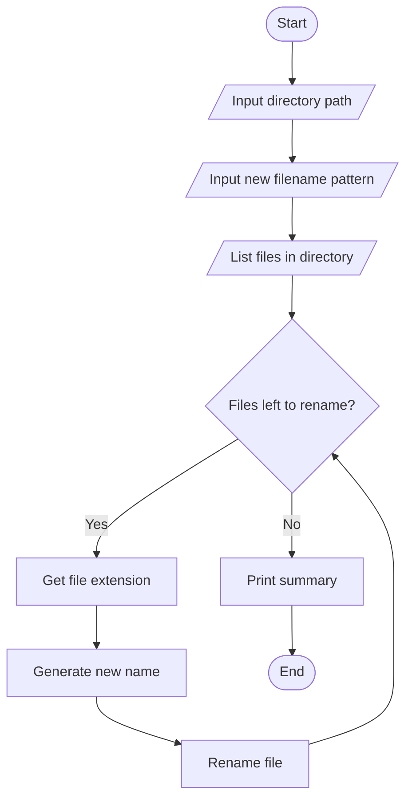

```mermaid
flowchart TD
    A([Start]) --> B[/Input directory path/]
    B --> C[/Input new filename pattern/]
    C --> D[/List files in directory/]
    D --> E{Files left to rename?}
    E -- Yes --> F[Get file extension]
    F --> G[Generate new name]
    G --> H[Rename file]
    H --> E
    E -- No --> I[Print summary]
    I --> J([End])
```